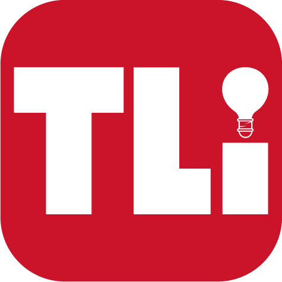

# BSCS Online Program UI Component Library

  
  <h3>CSU Channel Islands | TLi & Extended University</h3>
  
A visual component library for creating consistent Canvas online courses

## Welcome to the BSCS Style Manual

Welcome to the official style manual for the BS Computer Science Online Completion Program at CSU Channel Islands.

This repository serves as the central hub for all UI components, code snippets, and visual assets needed to create consistent, accessible, and pedagogically sound Canvas courses. Designed specifically for instructional designers, course developers, and faculty, this library streamlines the course creation process by providing ready-to-use components that maintain visual consistency across the entire program.

### Who This Repository Serves

- **TLi Team** - Teaching & Learning innovations staff responsible for overseeing course development
- **Construct Team** - Our vendor partners who build and implement courses in Canvas
- **Computer Science Faculty** - Subject Matter Experts who provide course content and teach the courses
- **Instructional Technologists** - Staff who support and maintain courses after development

### What You'll Find Here

This repository contains visual examples, code snippets, and templates that follow our program's design standards, accessibility requirements, and pedagogical approach. All components are:

- **Visually consistent** with our branding and color scheme
- **Fully accessible** and WCAG 2.2 AA compliant
- **Mobile-responsive** for students on any device
- **Easy to implement** with simple copy-and-paste code

Everything is organized visually with screenshots showing how components will look in Canvas, making it easy to find exactly what you need without diving into code first.

  <a href="#about">About</a> •
  <a href="#visual-components">Visual Components</a> •
  <a href="#templates">Templates</a> •
  <a href="#installation">Installation</a> •
  <a href="#style-guide">Style Guide</a> •
  <a href="#accessibility">Accessibility</a> •
  <a href="#contact-and-support">Contact and Support</a>

---

## About

This repository contains ready-to-use UI components for building Canvas courses for the BSCS Online Degree Completion Program. These components help ensure visual consistency, accessibility compliance, and pedagogical effectiveness across all courses.

✨ **[View Complete Style Guide Document](https://docs.google.com/document/d/1FqPsk0VLODkxEGyBLVnoIZRcHCWer9_nRR4w81oCWeE/edit?usp=sharing)**

## Visual Components

### Module Banners

  

Each module has a specific color scheme:
- **Module 0:** CSUCI branded red
- **Module 1-8:** Program color palette (green, blue, orange, etc.)

👉 **[Browse All Banners](components/banners/)**

### Instructional Icons

  

Standard icons for specific content types:
- 💡 Content Purpose
- 🎯 Learning Objectives
- 📖 Reading Materials
- 📺 Video Content
- 📝 Assignments

👉 **[Browse All Icons](components/icons/)**

### Interactive Elements

  

- Accordions
- Tabs
- Interactive Checklists
- Flip Cards

👉 **[Browse Interactive Elements](components/interactive/)**

## Templates

Pre-built page templates ready to use in Canvas:

  

    <h3>Module Overview</h3>
    
  

  

    <h3>Content Page</h3>
    
  

  

    <h3>Assignment</h3>
    
  

  

    <h3>Discussion</h3>
    
  

👉 **[Browse All Templates](templates/)**

## Installation

### Option 1: Copy & Paste (Recommended for Non-Technical Users)

1. Browse to the component you want
2. Click the component to view its HTML code
3. Click the "Copy" button
4. In Canvas, edit your page and click the HTML Editor button (<>)
5. Paste the code and customize as needed

  

### Option 2: Download Files

1. Click the green "Code" button above
2. Select "Download ZIP"
3. Extract the files to your computer
4. Open the files in a text editor to copy code as needed

## Style Guide

The complete style guide provides detailed guidelines on:

- Modular Content organization
- Accessibility requirements
- Best practices

👉 **[View Complete Style Guide](https://docs.google.com/document/d/1FqPsk0VLODkxEGyBLVnoIZRcHCWer9_nRR4w81oCWeE/edit?usp=sharing)**

## Accessibility

All components are designed to meet WCAG 2.2 AA standards:

- Proper heading structure
- Sufficient color contrast
- Screen reader compatibility
- Keyboard navigation support

For accessibility questions, contact Kristi O'Neil-Gonzalez (kristi.oneilgonzalez@csuci.edu).

## Contact and Support

For questions or support regarding this style manual, please reach out to:

* **Lorna Gonzalez:** Director of Digital Learning ([lorna.gonzales@csuci.edu](mailto:lorna.gonzales@csuci.edu))
* **Ana M. Penaranda:** Learning Design Lead & Project Manager ([ana.penarandaleal@csuci.edu](mailto:ana.penarandaleal@csuci.edu))
* **Kristi O'Neil-Gonzalez:** Accessibility & Inclusive Design Lead ([kristi.oneilgonzalez@csuci.edu](mailto:kristi.oneilgonzalez@csuci.edu))

---

  
© 2025 CSU Channel Islands, TLi & Extended University. All rights reserved.

