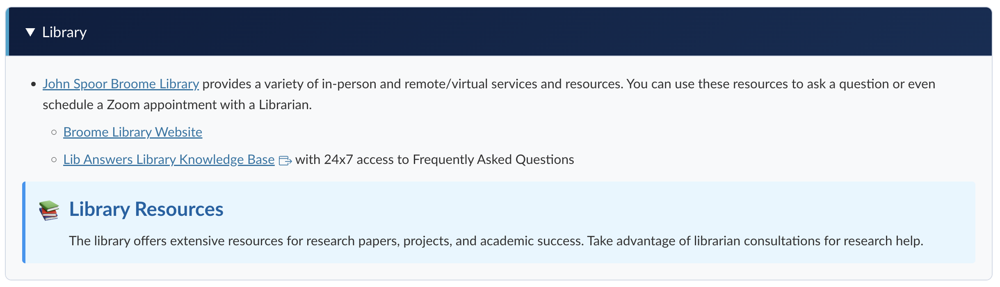

# BSCS Online Program UI Component Library

  
  <h3>CSU Channel Islands | TLi & Extended University</h3>
  
A visual component library for creating consistent Canvas online courses

## Welcome to the BS Computer Science Style Manual ✨

This repository serves as the central hub for all UI components, code snippets, and visual assets needed to create consistent, accessible, and pedagogically sound Canvas courses. Designed specifically for instructional designers, course developers, and faculty, this library streamlines the course creation process by providing ready-to-use components that maintain visual consistency across the entire program.

### Who This Repository Serves

- **TLi Team** - Teaching & Learning innovations staff responsible for overseeing course development
- **Construct Team** - Our vendor partners who build and implement courses in Canvas
- **Computer Science Faculty** - Subject Matter Experts who provide course content and teach the courses
- **Instructional Technologists** - Staff who support and maintain courses after development

### What You'll Find Here

This repository contains visual examples, code snippets, and templates that follow our program's design standards, accessibility requirements, and pedagogical approach. All components are:

- **Visually consistent** with our branding and color scheme
- **Fully accessible** and WCAG 2.2 AA compliant
- **Mobile-responsive** for students on any device
- **Easy to implement** with simple copy-and-paste code

Everything is organized visually with screenshots showing how components will look in Canvas, making it easy to find exactly what you need without diving into code first.

  <a href="#about">About</a> •
  <a href="#visual-components">Visual Components</a> •
  <a href="#style-guide">Style Guide</a> •
  <a href="#accessibility">Accessibility</a> •
  <a href="#contact-and-support">Contact and Support</a>

---

## About

This repository contains ready-to-use UI components for building Canvas courses for the BSCS Online Degree Completion Program. These components help ensure visual consistency, accessibility compliance, and pedagogical effectiveness across all courses.

✨ **[View Complete Style Guide Document](https://docs.google.com/document/d/1FqPsk0VLODkxEGyBLVnoIZRcHCWer9_nRR4w81oCWeE/edit?usp=sharing)**

[Example Course Pages](assets/images/example-preview.pdf)

---

## Visual Components

### Module Banners

  

Each module page will begin with a banner. Once the SME has finalized the modules titles, please notify Ana M Penaranda ([ana.penarandaleal@csuci.edu](mailto:ana.penarandaleal@csuci.edu)). She will upload the corresponding banner to the link below for you to download.

👉 **[Browse All Banners](components/banners/modules/)**

  
• • • • • • • • • • • • • • • • • • • •

### Emoji-Based Iconography 🎯

We're using emojis instead of traditional image icons to align with how newer generations communicate. Emojis are lightweight, look sharp on any screen size, are easy to customize, and come with built-in accessibility descriptions—making (Unicode characters) them a flexible and inclusive choice for our course design.

This table provides the recommended emojis for consistent and accessible iconography across modules in the online course.

| **Section**            | **Emoji** | **Unicode Code** | **Name**               |
|------------------------|-----------|------------------|------------------------|
| Module Overview        | 🧭        | U+1F9ED          | Compass                |
| Learning Objectives    | 🎯        | U+1F3AF          | Direct Hit (Target)    |
| Core Readings          | 📖        | U+1F4D6          | Open Book              |
| Lecture (Video)        | 🎬        | U+1F3AC          | Clapper Board          |
| Additional Resources   | 🔗        | U+1F517          | Link                   |
| Lab                   | ⌨️         | U+2328           | Keyboard               |
| Discussion             | 💬        | U+1F4AC          | Speech Balloon         |
| Quiz                   | 📝        | U+1F4DD          | Memo (Writing)         |
| Summary                | 🪄        | U+1FA84          | Magic Wand             |
| Key Takeaways          | 💎        | U+1F48E          | Gem Stone              |
| Before You Watch       | 📌        | U+1F4CC          | Pushpin                |
| Student Instructions   | 📋        | U+1F4CB          | Clipboard              |
| Reflection             | 🤔        | U+1F914          | Thinking Face          |
| Critical Analysis      | 🔍        | U+1F50D          | Magnifying Glass       |
| Content Connections    | 🧠        | U+1F9E0          | Brain                  |
| Assignment Description | 📝        | U+1F4DD          | Memo (Writing)         |
| Submission Information | 📤        | U+1F4E4          | Outbox Tray           |
| Grading Information    | 📊        | U+1F4CA          | Bar Chart             |
| Deadline Reminder      | ⏰        | U+23F0           | Alarm Clock           |
| Quiz Purpose           | ℹ️        | U+2139           | Information           |
| Quiz Details           | ⚙️        | U+2699           | Gear                  |
| Time Management        | ⏱️        | U+23F1           | Stopwatch             |
| Study Strategies       | 🧠        | U+1F9E0          | Brain                 |
| Module Wrap-Up         | 🏁        | U+1F3C1          | Checkered Flag        |
| Looking Ahead          | 🔭        | U+1F52D          | Telescope             |
| Tips for Success       | 💡        | U+1F4A1          | Light Bulb            |
| Sources                | 📝        | U+1F4DD          | Memo (Writing)        |

For PDFs, use the image icon provided in the link below. 

   

👉 **[Browse All Icons](components/icons/)** 

When in doubt about which emoji to use, contact Ana M. Peñaranda ([ana.penarandaleal@csuci.edu](mailto:ana.penarandaleal@csuci.edu)).

  
• • • • • • • • • • • • • • • • • • • •

### Interactive Elements

  

- Accordions
- Callouts
- Buttons
- Back to Top Button
- Sections and Cards

👉 **[Browse Interactive Elements](https://tlinnovations.github.io/BSCS_Program_Style-Manual/)**

  
• • • • • • • • • • • • • • • • • • • •

## Style Guide

The complete style guide provides detailed guidelines on:

- Modular Content organization
- Accessibility requirements
- Best practices

👉 **[View Complete Style Guide](https://docs.google.com/document/d/1FqPsk0VLODkxEGyBLVnoIZRcHCWer9_nRR4w81oCWeE/edit?usp=sharing)**

  
• • • • • • • • • • • • • • • • • • • •

## Accessibility

All components are designed to meet WCAG 2.2 AA standards:

- Proper heading structure
- Sufficient color contrast
- Screen reader compatibility
- Keyboard navigation support

For accessibility questions, contact Kristi O'Neil-Gonzalez (kristi.oneilgonzalez@csuci.edu).

---
## Contact and Support

For questions or support regarding this style manual, please reach out to:

* **Lorna Gonzalez:** Director of Digital Learning ([lorna.gonzales@csuci.edu](mailto:lorna.gonzales@csuci.edu))
* **Ana M. Penaranda:** Learning Design Lead & Project Manager ([ana.penarandaleal@csuci.edu](mailto:ana.penarandaleal@csuci.edu))
* **Kristi O'Neil-Gonzalez:** Accessibility & Inclusive Design Lead ([kristi.oneilgonzalez@csuci.edu](mailto:kristi.oneilgonzalez@csuci.edu))

---

  
© 2025 CSU Channel Islands, TLi & Extended University. All rights reserved.

